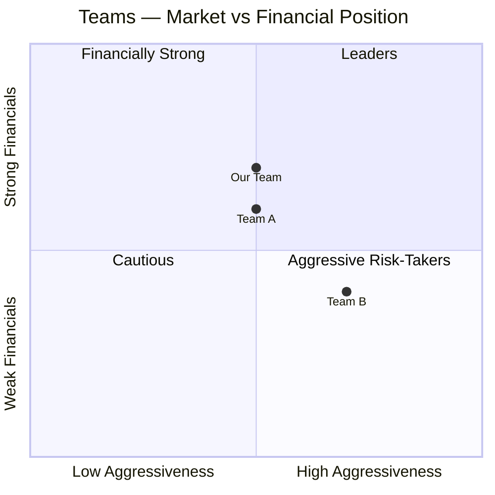

<!--
TEMPLATE FILE — DO NOT PRESENT DIRECTLY.
Use this frontmatter + style when generating cesim_journey.md.

Reusable slide patterns below (copy as needed into cesim_journey.md):
-->

---

<!-- PATTERN: KPI Dashboard slide -->
# Round N — Results

| Metric | Value | vs Prior | Status |
|--------|-------|----------|--------|
| Net Sales (mUSD) | | +X% | 🟢 |
| EBITDA Margin | | +X pp | 🟢 |
| Cash (mUSD) | | | 🟡 |
| Market Share | | | 🟢 |
| Share Price (USD) | | | 🔴 |

> **Verdict:** One sentence on this round's outcome.

---

<!-- PATTERN: Decision table slide -->
# Round N — Decisions

| Area | Decision | Rationale |
|------|----------|-----------|
| R&D | | |
| Production | | |
| Marketing | | |
| Finance | | |

**Bold moves:** decision 1, decision 2

---

<!-- PATTERN: Market conditions slide -->
# Round N — Market & Context

**Demand growth:** USA X% | Asia X% | Europe X%

**Strategic mode entering:** Balanced / Defensive / Expansion

**Key macro change:** [one line]

**Competitor moves:** [2-3 bullet points]

---

<!-- PATTERN: Financial trajectory Mermaid -->
# Financial Trajectory

```mermaid
xychart-beta
  title "Net Profit (mUSD) by Round"
  x-axis ["R1", "R2", "R3", "R4", "R5", "R6"]
  y-axis "Net Profit (mUSD)"
  line [0, 0, 0, 0, 0, 0]
```

---

<!-- PATTERN: Competitive quadrant -->
# Competitive Landscape


